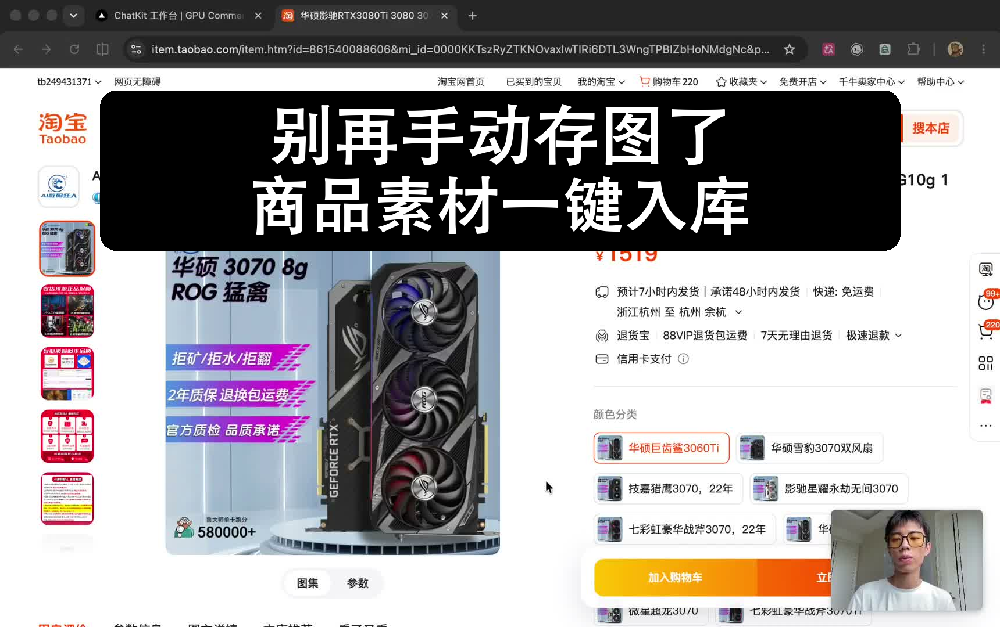
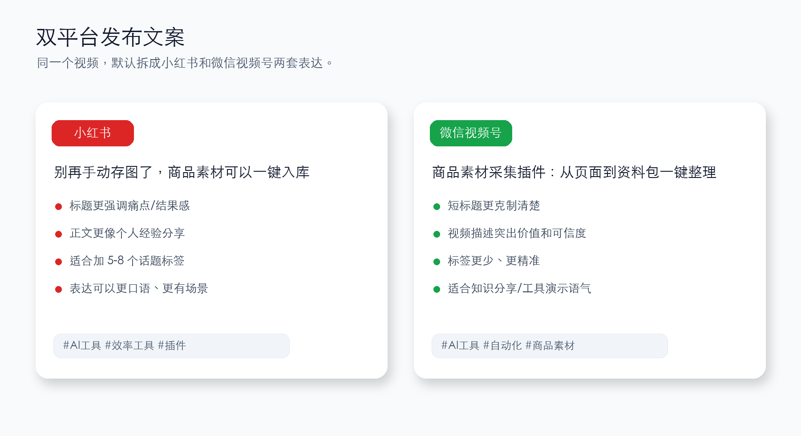

# Video Channel Polish

一个面向中文录屏口播视频的 Codex Skill，用来把原始演示素材处理成适合小红书和微信视频号发布的成品。


适合这类视频：

- 录屏 + 右下角人像的工具演示
- AI 工具、插件、自动化工作流分享
- 非正式口播里有卡壳、重说、长停顿的素材
- 需要同时准备小红书和微信视频号发布文案的视频

它沉淀了一套固定流程：

```text
原始录屏 -> 去卡壳/压停顿 -> 字幕 -> 封面 -> 双平台发布文案 -> 安全清理
```

## 能做什么

- 分析视频参数、长停顿和口播节奏
- 去掉明显卡壳、重说和长空白
- 轻微提速到更适合短视频发布的语速
- 自动转写中文口播并生成硬字幕
- 修正常见识别错词，例如 `竞品调研`、`SKU 图`、`详情图`
- 从视频前几秒生成黑底白字封面图
- 分别准备小红书和微信视频号发布文案
- 把不需要的中间版本安全移动到 macOS 废纸篓

## 典型输出

一次完整处理通常会产出：

- 精剪后的无字幕视频
- 烧录字幕的视频
- 独立封面图
- 小红书发布文案
- 微信视频号发布文案
- 可选：带封面片头的视频

默认不会把封面强行接到视频开头，除非你明确要求。

## 效果示例

### 封面

封面默认从视频前几秒选真实画面，不额外换背景、不模糊、不压暗，只叠加黑色圆角标题条和白色大字。



### 字幕

字幕默认贴近底部，减少对演示界面和右下角人像的遮挡。


## 安装

把仓库克隆到 Codex skills 目录：

```bash
git clone https://github.com/wanghaoyu070/video-channel-polish.git \
  ~/.codex/skills/video-channel-polish
```

如果目录已存在，可以进入目录更新：

```bash
cd ~/.codex/skills/video-channel-polish
git pull
```

## 使用方式

在 Codex 中可以这样说：

```text
用 video-channel-polish 处理这段录屏素材
```

或者更具体一点：

```text
用 video-channel-polish 帮我把这个视频剪成适合视频号发布的版本，加字幕、做封面，并准备小红书和微信视频号文案
```

也可以只做其中一部分：

```text
用 video-channel-polish 把这个字幕再往下移一点
```

```text
用 video-channel-polish 给这个视频生成黑底白字封面
```

```text
用 video-channel-polish 为这个视频准备小红书和微信视频号发布文案
```

## 默认风格

- 字幕：白字、黑色描边、半透明黑底，位置偏底部
- 字幕默认参数：`font-size 42`，`bottom-y-ratio 0.92`
- 封面：视频前几秒真实画面 + 黑色圆角标题条 + 白色大字
- 默认封面标题：
  - `别再手动存图了`
  - `商品素材一键入库`
- 发布文案：默认输出小红书和微信视频号两套

## 发布文案规则

这个 Skill 会默认区分两个平台：



### 小红书

- 更像个人经验分享
- 标题更有痛点或结果感
- 正文可以稍微口语化
- 通常附带 5-8 个话题标签

### 微信视频号

- 更克制、清楚、可信
- 适合填写短标题和视频描述
- 标签更少，更偏精准

## 依赖

需要本机可用：

- `ffmpeg`
- `ffprobe`
- Python 3
- Python 包：`Pillow`
- 可选但推荐：`faster_whisper`，用于中文转写

如果缺少 `faster_whisper`，仍然可以做剪辑和封面，但自动字幕能力会受影响。

## 目录结构

```text
.
├── SKILL.md
├── agents/
│   └── openai.yaml
├── assets/
│   └── readme/
│       ├── cover-example.png
│       ├── platform-copy.png
│       ├── subtitle-position.png
│       └── workflow-overview.png
├── references/
│   └── style_defaults.md
└── scripts/
    ├── burn_subtitles.py
    ├── clean_speech_video.py
    ├── make_black_title_cover.py
    ├── prepend_cover.py
    ├── safe_cleanup.py
    └── transcribe_subtitle.py
```

## 注意事项

- Skill 会尽量保留原始视频，不覆盖源文件。
- 不需要的生成版本默认移动到 `~/.Trash`，不会直接永久删除。
- 默认只生成封面图，不会把封面强行加到视频开头，除非明确要求。
- 不要把原始视频、导出成片、账号截图或临时文件提交到这个仓库。

## License

未指定许可证。使用或分发前请根据你的公开分享需求补充合适的 License。
